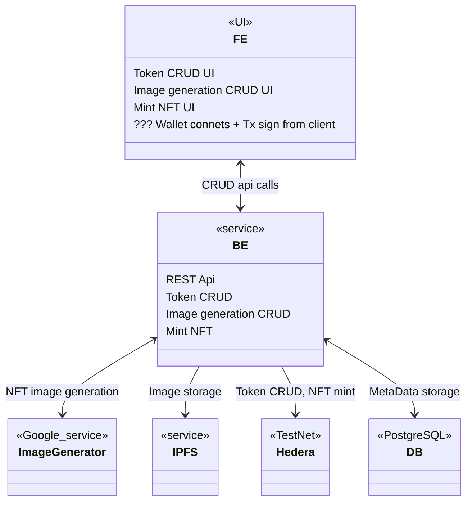

# Hash Arts

# Architecture

```mermaid
classDiagram
    class FE {
        <<UI>>
        Token CRUD UI
        Image generation CRUD UI
        Mint NFT UI
        ??? Wallet connets + Tx sign from client
    }
    class BE {
        <<service>>
        REST Api
        Token CRUD
        Image generation CRUD
        Mint NFT
    }
    class ImageGenerator {
        <<Google_service>>
    }
    class IPFS {
        <<service>>
    }
    class Hedera {
        <<TestNet>>
    }
    class DB {
        <<PostgreSQL>>
    }
    FE <--> BE : CRUD api calls
    BE <--> ImageGenerator : NFT image generation
    BE --> IPFS : Image storage
    BE --> Hedera : Token CRUD, NFT mint
    BE <--> DB : MetaData storage
```